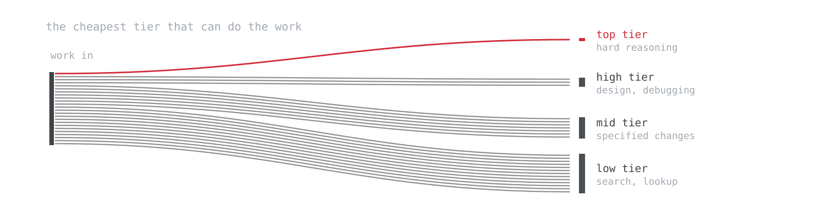

<picture>
  <source media="(prefers-color-scheme: dark)" srcset="assets/banner-dark.svg">
  
</picture>

# claude-code-token-optimization

A configuration that reduces token consumption in Claude Code without moving reasoning to weaker models, plus the scripts to check whether it worked on your own machine.

*Above: the mechanism, drawn rather than measured. Every turn re-reads the transcript so far, so cost per turn climbs and total cost is the area under it. Resetting the session sets it back to zero.*

Four layers, installed independently. Each one acts on a different part of the bill:

| Layer | Acts on | Status |
|---|---|---|
| Model tiering | which model does which work | measured, adopted |
| Output filtering | how much tool output enters context | self-reported by the tool, not independently measured |
| Policy blocks | when to delegate, when to write code, how much to report | measured indirectly through adoption and rework proxies |
| Session hygiene | how long a session grows before it is reset | identified as the dominant driver, least automated |

What was measured, for the one operator this data comes from: layer 1 was adopted in practice, shifted work to cheaper tiers, and reduced every cost component it acts on by 15% to 18% per unit of work. Measured rework did not get worse and by two proxies improved slightly, which is the part that matters, since a cost reduction bought with more mistakes is not a saving.

The second finding is about a layer most optimization guides ignore. Cache reads, the cost of re-reading a session's own transcript on every turn, were roughly two thirds of total spend. That component is untouched by model choice and is governed almost entirely by how long a session runs before it is reset. Layer 4 is where it is addressed, and it is free.

Full method, reference results, and the limitations that qualify them are in [claude-code-measure-efficiency](https://github.com/makinggainz/claude-code-measure-efficiency). The measured-period net figure and what it does and does not mean is in [What the net number showed](#what-the-net-number-showed) at the end.

## Install

Everything is optional and independent. Nothing here is a package, and there is no state beyond the files you copy.

```bash
git clone https://github.com/makinggainz/claude-code-token-optimization
cd claude-code-token-optimization

cp agents/*.md ~/.claude/agents/          # layer 1
cat CLAUDE.md.example >> ~/.claude/CLAUDE.md   # layer 3
```

For layer 2, install [rtk](https://github.com/rtk-ai/rtk) and let it wire its own hook:

```bash
rtk init --hook-only
```

Then merge the relevant keys from [`settings.json.example`](settings.json.example) into `~/.claude/settings.json`.

**Measure before you install.** The point of this repository is that the claim is checkable. Record a baseline first:

```bash
python3 verify/usage_report.py --days 30
```

## Layer 1: model tiering

Seven subagent definitions in [`agents/`](agents/), each pinned to a model tier.

The principle is that work whose failure mode is cheap and immediately visible runs on inexpensive models, and work whose failure mode is expensive stays on capable ones. Reasoning is never moved down a tier to save money. A wrong architectural decision costs far more than the tokens saved by making it on a cheap model.

| Agent | Model | Purpose |
|---|---|---|
| `deep-analyst` | top tier | Escalation only. Problems that already resisted a serious attempt. |
| `architect` | high tier | Design decisions and difficult debugging. Read-only, returns a plan. |
| `implementer` | mid tier | Executes an already-decided specification. |
| `test-runner` | mid tier | Runs verbose commands, reports only failures. Never fixes. |
| `scout` | low tier | Read-only code and file discovery. |
| `web-researcher` | low tier | Documentation and error lookup, returns a distilled answer. |
| `second-opinion` | low tier | Relays a verdict from a non-Claude model via a local CLI. |

Two design notes the adoption data supports.

`scout` exists because the built-in Explore agent inherits the main conversation's model, so unguided searching runs at the main model's rate. A cheap-tier alternative with an explicit description displaced it: Explore dispatches fell from 46 to 8 after installation.

The set is deliberately small. Large agent libraries create overlapping descriptions, and the routing model selects by matching a task against those descriptions. These seven were selected in 47% of dispatches where the prior state was 1%. Curation appears to matter more than coverage.

There is a second effect that is easy to miss. A subagent runs in its own context, so its tokens never enter the main conversation and never become part of the transcript that is re-read on every subsequent turn. Delegating a verbose search is therefore worth more than the tier difference alone suggests.

## Layer 2: output filtering at the tool boundary

Raw command output is one of the largest uncontrolled inputs to a session. A directory listing, a process table, a linter run, or a fetched HTML page can each be tens of thousands of tokens, most of it padding, repetition, and formatting.

[rtk](https://github.com/rtk-ai/rtk) is a CLI proxy that filters and compacts that output before it reaches the model. A `PreToolUse` hook rewrites `Bash` commands to their proxied equivalent transparently, so no change in habit is required. It is a separate Apache-2.0 project, not vendored here; install it from upstream.

Reported reduction on proxied output for this operator, across roughly 20,000 commands, was 64.8%. Where that saving comes from is more useful than the headline:

| Command | Average reduction | Share of total saving |
|---|---|---|
| `grep` | 32.8% | 44% |
| `read` | 20.8% | 11% |
| `ls` | 60.6% | 10% |
| `ps aux` | 99.0% | 10% |

The pathological cases compress the most, and contribute the least. Almost half of the total saving came from `grep`, which has the *lowest* per-call reduction in the table and simply runs constantly. Frequency dominates compressibility. If you are choosing where to filter, filter what you run most, not what looks worst.

Two honest caveats. These percentages are the tool's own accounting, comparing raw output to filtered output; they are not measured through Claude Code transcripts, and no independent verification is offered here. And filtering is lossy by design, so a filtered output can omit the one line that mattered; treat `rtk proxy <cmd>` as the escape hatch when a result looks wrong.

This layer compounds with layer 4. Output that never enters the transcript is not merely cheap once; it is absent from every future cache read in that session.

## Layer 3: policy blocks

[`CLAUDE.md.example`](CLAUDE.md.example) contains three blocks, loaded once per session at a combined cost of roughly 200 tokens.

**Delegation policy.** Small work is done inline, because a delegation costs a fresh context, a re-exploration, and a report that must then be read. That overhead exceeds the saving on short tasks. Decisions are never delegated, and difficulty escalates upward rather than settling for a cheaper tier's answer.

**Reuse ladder.** Checks whether code needs to exist, whether the codebase already provides it, and whether a dependency covers it, before new code is written. Correctness, boundary validation, security, and accessibility are explicitly excluded from reduction.

**Report calibration.** Matches write-up length to task significance. Failures, caveats, and the line between verified and assumed are excluded from trimming.

The reason these are worth their tokens is that they act on behavior every turn, for a one-time cost.

## Layer 4: session hygiene

This is the largest lever and the one with the least tooling behind it.

Every turn re-reads the transcript accumulated so far. Cost therefore grows with the square of session length, roughly: more turns, each re-reading more history. In the reference measurement, cache reads were 57% of cost-equivalent in the baseline period and 65% afterward, while average session length grew from 132 to 213 turns.

Session length is an operator behavior, not a property of any configuration. Nothing in layers 1 through 3 lengthens or shortens a session; the decision to keep going in an existing conversation rather than starting a fresh one is made by the person at the keyboard. That is what makes this the largest available lever: it costs nothing, requires no installation, and is entirely under your control.

What follows from that:

- **Start a new session when the task changes.** A finished task's transcript is pure cost on every subsequent turn. `/clear` is free and instant.
- **Do not switch model or effort mid-session.** Either invalidates the prompt cache, forcing a full re-read at the uncached rate. Choose at session start. A subagent's model never touches the parent's cache, which is another reason to delegate rather than switch.
- **Watch where the cost actually concentrates.** In one 7-day sample, the top 10% of sessions by cost held 65% of total cost-equivalent, and sessions above the 90th percentile in length held 70% of all cache read cost. A small number of runaway sessions dominate.

`verify/session_growth.py` reports exactly this, per session, so runaway sessions are visible rather than inferred.

No hook is shipped for this. A threshold warning is straightforward to build and has not been validated, so it is not offered as advice.

## Verifying it on your own machine

The scripts in [`verify/`](verify/) are the reason to take any of the above seriously, or to reject it. They read the transcripts Claude Code already writes to `~/.claude/projects/`, transmit nothing, and print aggregate counts only. No conversation content is written to output. Python 3.8 or later, no dependencies.

```bash
python3 verify/usage_report.py --days 30           # baseline, before installing
python3 verify/usage_report.py --since YYYY-MM-DD  # compare two periods
python3 verify/decompose.py YYYY-MM-DD             # cost per unit of work, four components
python3 verify/friction.py YYYY-MM-DD              # rework proxies
python3 verify/session_growth.py                   # per-session context growth
```

Pass the date the configuration change took effect.

Three values indicate whether the configuration is being used at all: the share of dispatches going to these agents, the low-tier share of tokens, and the Explore dispatch count. If the first two do not rise, the configuration is installed but inactive, and the correct response is to remove it rather than to assume it is helping.

Read `decompose.py` output before concluding anything. A total that moved the wrong way while its components moved the right way is the normal case, not an anomaly, and the components are where the explanation is.

These scripts are copies of the tooling in [claude-code-measure-efficiency](https://github.com/makinggainz/claude-code-measure-efficiency), included here so this repository is self-sufficient. That repository is canonical: it carries the method, the full reference results, and the limitations that qualify them. If the two ever disagree, it is correct.

## Cost-equivalent is not a bill

The scripts apply published API list rates to observed token counts. On a subscription the amount paid is fixed regardless. Cost-equivalent is a unit for comparing one period against another, and it is meaningless as an absolute. Rates are constants at the top of each script and need updating when list prices change.

## Evaluated and not adopted

Recorded because a list of what was rejected is more informative than a list of what was kept.

- **Open verdict: knowledge-graph indexing of a repository.** One successful test, on a small codebase, where the extracted call chain verified correct against source with no fabricated edges. One test is not a verdict. The document-extraction layer produced some dangling edges while the syntax-tree layer produced none, and an unfiltered scan will attempt a vision call per image unless images are excluded first. Not recommended either way yet.
- **Rejected: proxy-level prompt compression.** Compressing requests in transit trades output quality for tokens, and overlaps with layer 2 while being far harder to reason about when something goes wrong.
- **Rejected: terse-speak output compression.** Instructing the model to drop articles and function words does reduce output tokens. Output tokens were the smallest component in the decomposition, and readability is the product.

## What the net number showed

Stated here rather than at the top, because it measures the operator as much as the configuration, and reading it as a verdict on the configuration would be a misreading.

Across the measured period, net cost-equivalent per unit of work rose 3.8%. The decomposition shows where that came from. Every component model tiering acts on fell, by 15% to 18%. The single component it does not act on, cache reads, rose 19%, and because cache reads are roughly two thirds of the total, that one movement set the direction of the sum.

The cache read increase tracks session length, which grew 60% over the same period. Holding cache read per unit at its baseline value and leaving every other measured change in place gives −7.0% instead. That figure is a model rather than a measurement, and it assumes session length would have been unchanged, which is an assumption and not an observation.

Two things follow. The first is that this is a layer 4 problem, addressable by starting fresh sessions more often, and not evidence against layers 1 through 3. The second is a caution against reading the arithmetic too confidently in the other direction: a mechanism by which delegation indirectly lengthens sessions is not hard to imagine, since work moved into a subagent's context leaves more room in the main one. That was not tested. The measurement period also coincided with unusually long analysis sessions spent building these very scripts, which is a workload confound rather than a behavioral one.

The honest summary is that the components were measured and moved as intended, the total is confounded by a concurrent behavior change, and no net saving is claimed.

## Limitations

1. One operator, one machine, one workload. The reference results indicate direction, not magnitude, and are not generalizable without replication.
2. The periods compared were not a controlled experiment. Workload composition differed between them, and part of the measured change is attributable to that rather than to the configuration.
3. Layer 2's reduction figures are the tool's own self-report, on a different basis from every other number here.
4. The verification scripts parse an undocumented internal transcript format. Format changes will break them.
5. Output tokens are used as the proxy for work produced. A refactor and a long explanation are not equivalent work at equal token counts.
6. Friction metrics measure friction, not correctness. Nothing here measures whether the output was right.

## License

MIT. See [LICENSE](LICENSE). `rtk` is a separate project under its own license and is linked, not included.
